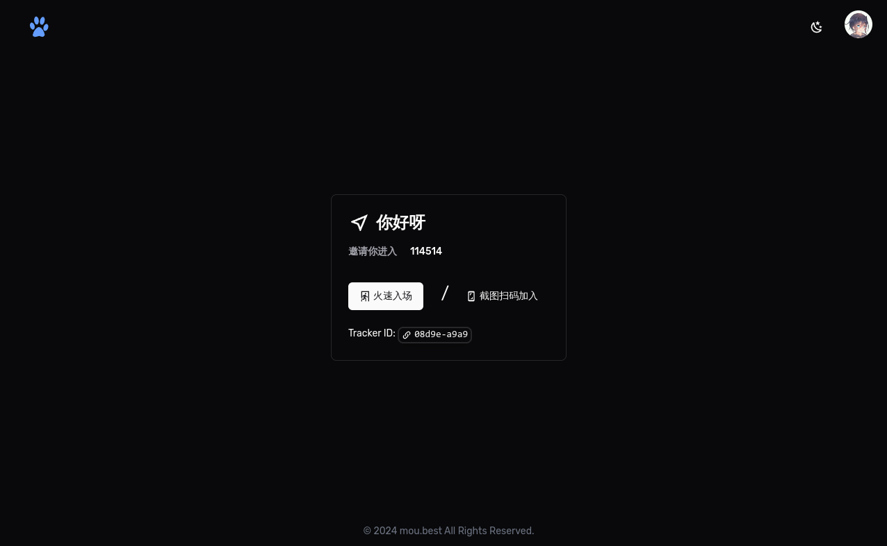
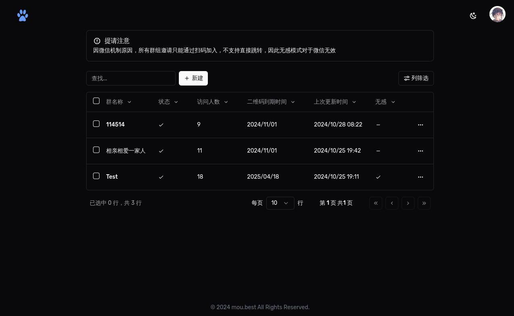

# Rimo 的微信群组二维码活码网站

## 应用

由于微信邀请二维码仅能七天内有效，并且单个二维码仅能允许 200 人进群，因此实时更新二维码显得很有必要

由于线下宣传的物料不可能为每张单子的二维码进行更新，因此做一次中间跳转成了最佳选择，方便管理，并且能够不让二维码失效

但是但是但是，由于其原理仍是解析二维码，本来无需在站内二次扫码，而不知道为何，微信貌似不允许从微信内部浏览器跳转到群组的邀请链接，因此在网站内进行二次扫码加入群聊成了唯一选择

## Todo

- [x] 基本功能
- [ ] Nuxt Icon 未缓存，首次访问甚至会掉图标（？）
- [ ] 单码对多码，7天内超200人自动换码
- [ ] 在微信上实现无感跳转，无需二次扫码

## 部署

本站优先部署在 `netlify` 上，配置好正确的 `.env` 即可运行

非 `netlify` 记得修改 `nuxt.config.ts` 内的 unstorage 配置

当然如果你还愿意的话可以顺带更换一下 `public` 内的图片什么的
